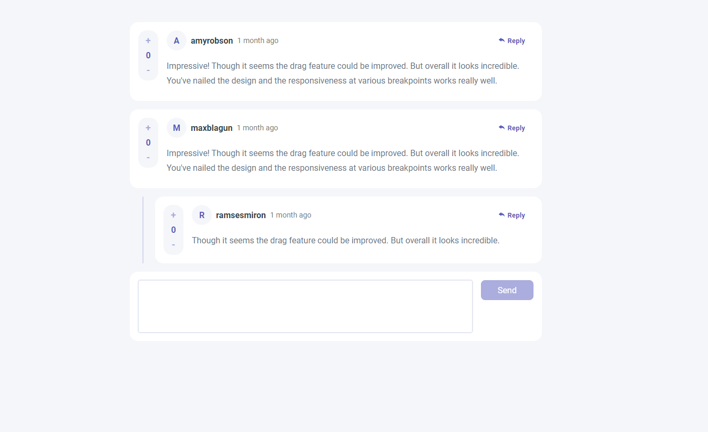

# Interactive Comments



## Sobre o Projeto

Este projeto é uma seção de comentários onde o usuário pode responder comentários de outros usuários.

## Projeto ao vivo

https://interactive-comments-ivory.vercel.app/


## Funcionalidades

- Home

  - :heavy_check_mark: interface responsiva
  - :heavy_check_mark: validação dos inputs do formulário
  - :heavy_check_mark: responder comentários
  - :heavy_check_mark: excluir comentário
  - :heavy_check_mark: editar comentário

## Libs e recursos usados

- styled components 

## Como Rodar

Depois de estar dentro do repositório:

```

npm start

# output - http://localhost:3000/

```